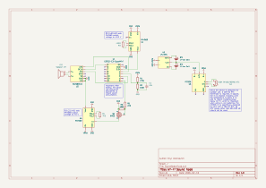

# WiFiSoundNode

## Project Purpose

WiFiSoundNode was created primarily as a companion device for the
[BirdIdentifier](https://github.com/uxabix/BirdIndentifier?tab=readme-ov-file) project,
where it is used as a low-power network audio output node for playing bird
sounds and audio notifications.

At the same time, WiFiSoundNode is deliberately designed as a **fully
standalone device**. It does not depend on BirdIdentifier or any other specific
backend and can be used independently as a generic Wi-Fi audio speaker.

The device connects only via Wi-Fi and exposes a simple HTTP API, allowing it
to be easily integrated into **any other project** without modifying the
firmware. Audio playback can be triggered remotely, either by playing files
stored on the device or by streaming audio data directly from a client.

Conceptually, WiFiSoundNode acts as a **Wi-Fi speaker**:
- it can play preloaded audio files,
- it can receive and play audio streams over the network,
- and it can be controlled entirely over HTTP.

Special attention was paid to **power efficiency**. The firmware is optimized
for battery-powered operation, achieving:
- approximately **0.1 W power consumption while idle**, and
- nearly **0 W consumption in Deep Sleep mode**.

This makes WiFiSoundNode suitable not only for BirdIdentifier, but also for
portable, autonomous, and energy-efficient audio applications.

**WiFiSoundNode** is an ESP32-based network audio player designed for efficiency and remote control. It plays `.wav` files stored on the internal filesystem (LittleFS) or streams raw audio data over WiFi. The project includes advanced power management features like battery monitoring and a scheduled "Night Mode" deep sleep.

## Electrical Schematic

> **Schematics files:**  
> The KiCad schematic files are available in the folder: `KiCad Scheme/SoundNode/`  
> Exported schematic images are available in the folder: `Images/`

The schematic below shows the main connections of the device, including the MCU, power management, sensors, and audio output.



## Features

*   **Audio Playback**: High-quality playback via I2S (supports MAX98357A, PCM5102, etc.).
*   **File System**: Plays standard `.wav` files stored in LittleFS.
*   **Streaming**: Supports real-time audio streaming via HTTP POST (raw PCM/WAV).
*   **REST API**: Control playback, stop audio, and query status via HTTP endpoints.
*   **Battery Management**: Monitors battery voltage and percentage. Automatically enters Deep Sleep if voltage is critical.
*   **Smart Sleep**: Synchronizes time via NTP and enters Deep Sleep during configured night hours to conserve power.
*   **Power Efficiency**: Uses CPU frequency scaling (80MHz) and WiFi power-saving modes.

## Hardware Requirements

*   **ESP32** Development Board.
*   **I2S Amplifier Module** (e.g., MAX98357A).
*   **Speaker**.
*   **Battery** (any type) with a voltage divider connected to an ADC pin (optional).
*   **DC-DC converters**.

## Configuration

The application relies on a `include/config.h` file (not included in the repo, you must copy it from [config.h.example](include/config.h.example)) to define pinouts and settings.

### Battery Configuration and Chemistry Considerations

The default battery-related parameters in this project are tuned for a 2S Li-ion battery configuration (two cells in series):
- Maximum voltage: 8.4 V
- Nominal operating range: ~6.5–8.2 V
- Critical shutdown threshold: ~5.8 V

Many calibration values, including:
- voltage divider ratio
- ADC gain calibration
- correction thresholds

are selected with this configuration in mind.

---

### Using a different battery configuration or chemistry

WiFiSoundNode is not limited to 2S Li-ion batteries.
Other configurations (1S, 3S, LiFePO₄, NiMH, supercapacitors, etc.) are possible, but require recalculation of several parameters.

When changing battery configuration, you must:

1. Recalculate the voltage divider

    The divider must ensure that the maximum battery voltage never exceeds the ADC input range (≈2.5 V with 11 dB attenuation on ESP32-C3).
    ```
    V_adc_max = V_batt_max × (R2 / (R1 + R2)) ≤ 2.5 V
    ```
Incorrect divider selection may:
- saturate the ADC
- reduce resolution
- or permanently damage accuracy

2. Update voltage thresholds

    Battery voltage limits are chemistry-dependent and must be adjusted:
    ```c
    #define BATT_MAX_VOLTAGE       ...
    #define BATT_MIN_VOLTAGE       ...
    #define BATT_CRITICAL_VOLTAGE  ...
    ```

    Using incorrect thresholds may result in:
    - incorrect battery percentage
    - premature shutdown
    - over-discharge
    - reduced battery lifespan

3. Recalibrate ADC coefficients

After changing the divider or battery chemistry:
- BATT_CAL_FACTOR must be recalibrated
- Non-linearity correction thresholds may need adjustment

Calibration should always be performed using real measurements, not theoretical values.

#### Important note
The ADC correction model assumes:
- monotonic battery discharge
- relatively slow voltage changes
- DC measurement via a resistive divider

If your application deviates from this (e.g. high load transients, switching noise, fast current spikes), additional filtering or averaging may be required.

### ADC Calibration and Battery Voltage Accuracy

ESP32 (including ESP32-C3) ADCs are known to have significant gain error and non-linear behavior, especially when using high attenuation levels (11 dB) required for battery voltage measurement.
Without calibration, this can lead to incorrect battery readings and unreliable protection behavior.

To address this, WiFiSoundNode implements a two-stage ADC calibration model.

---

#### Why calibration is required

When measuring battery voltage:
- The ADC reference voltage varies between chips
- High attenuation introduces non-linearity
- Errors increase noticeably at lower voltages
- Uncalibrated readings may differ by 0.2–0.4 V

This is critical because:
- Battery percentage becomes inaccurate
- Deep-sleep protection may trigger too early (wasting capacity)
- Or too late (risking over-discharge)

Calibration Model Overview
### 1. Global Gain Calibration
```c
#define BATT_CAL_FACTOR  1.165f
```
This coefficient compensates systematic gain error caused by:
- ADC reference voltage variation
- Voltage divider tolerance
- Board-specific analog characteristics

How to calibrate:
- Fully charge the battery (e.g. 8.40 V for 2S Li-ion)
- Measure the voltage with a multimeter
- Read the voltage reported by the device
- Calculate:
```
BATT_CAL_FACTOR = V_real / V_measured
```

This factor is board-specific and should be tuned once per device.

---

### 2. ADC Non-Linearity Compensation
```c
#define BATT_CORR_HIGH_TH   7.8f
#define BATT_CORR_MID_TH    6.8f

#define BATT_CORR_HIGH_K    1.02f
#define BATT_CORR_MID_K     1.03f
#define BATT_CORR_LOW_K     1.04f
```

ESP32 ADCs are not linear across the full voltage range.
Accuracy degrades noticeably at lower voltages.

To compensate for this, a piecewise linear correction is applied:

- High voltage range → minimal correction
- Mid range → moderate correction
- Low range → stronger correction

This approach significantly improves accuracy without heavy computation or lookup tables.

Correction Flow
```c
ADC raw value
    ↓
Voltage divider calculation
    ↓
Global gain calibration (BATT_CAL_FACTOR)
    ↓
Piecewise non-linearity compensation
    ↓
Final battery voltage
```

### What if you don’t want to calibrate?

You can disable calibration by using:
```c
#define BATT_CAL_FACTOR  1.0f
#define BATT_CORR_HIGH_K 1.0f
#define BATT_CORR_MID_K  1.0f
#define BATT_CORR_LOW_K  1.0f
```

⚠️ Important trade-offs:
- Battery voltage will be approximate
- Reported percentage may be inaccurate
- Protection may trigger too early or too late
- Behavior may differ between devices

This is acceptable for non-critical or experimental setups, but not recommended for battery-powered or unattended operation.

## Power consumption

The device was designed with a strong focus on minimizing power consumption. To achieve this, the Wi-Fi transmitter power and radio activity are reduced by default. If this causes connectivity issues, the settings can be adjusted in `main.cpp` inside `void setup()`:
```cpp
WiFi.setSleep(true);
WiFi.setTxPower(WIFI_POWER_8_5dBm);
esp_wifi_set_ps(WIFI_PS_MIN_MODEM);
esp_wifi_set_max_tx_power(38); // ≈ 9.5 dBm
```

The MCU clock frequency can also be increased in the same location, which will improve performance but increase power usage:
```cpp
setCpuFrequencyMhz(80);
```

Lower frequencies are not recommended, as the web server becomes unstable or non-functional below this value.

To further conserve energy, the firmware includes a configurable sleep schedule (recommended for nighttime use). During the configured sleep period, the device is completely unavailable.

1. Use synchronous DC-DC converters
    For maximum efficiency, prefer synchronous DC-DC converters over non-synchronous designs.
2. Prefer step-down–only power architecture
    When choosing the battery configuration, aim for a setup that requires only buck (step-down) converters. They typically offer slightly higher efficiency than boost converters.
3. Use the 5 V converter EN pin
    Control the 5 V converter (powering the audio amplifier) via its EN pin to reduce idle power consumption.
4. Remove indicator LEDs to minimize power draw
    Disable or desolder all indicator LEDs to further reduce standby and idle power consumption.
5. When integrating the device with external systems, reduce the frequency of status and battery polling whenever possible. 
   Each server request — especially those involving audio output, ADC measurements, or filesystem access — increases overall power consumption.

> **Testing flags notice**  
> Enable the following flags in `platformio.ini` during testing and debugging.  
> They must be disabled after testing to minimize power consumption.

**Testing configuration:**
```ini
build_flags =
    -DDEBUG_BUILD
    -DARDUINO_USB_MODE=1
    -DARDUINO_USB_CDC_ON_BOOT=1
```
**Production (low power) configuration:**
```ini
build_flags =
    ; -DDEBUG_BUILD
    -DARDUINO_USB_MODE=0
    -DARDUINO_USB_CDC_ON_BOOT=0
```

## Other notes

- **Outdoor installation**
  
    When using the device outdoors, a sealed enclosure is strongly recommended. If any connectors are exposed outside the enclosure, use appropriate protective caps or plugs. This helps minimize the risk of moisture and dust ingress and can also assist in maintaining a slightly higher internal temperature during cold conditions.
- **Lithium batteries and low temperatures**

    Lithium-ion batteries should not be used or stored in severe cold (below -20°C). Low temperatures degrade performance, increase internal resistance, and can lead to unsafe charging conditions.
- **Battery performance in cold environments.**  
  
    Lithium battery capacity may decrease by up to 50% at low temperatures. This can significantly affect runtime and system behavior.
- **NTC**
  
    Since the device is designed for outdoor use, a 100 kΩ NTC thermistor is required. It signals the IC to disable charging when the temperature is below 0 °C and to reduce charging power below 10 °C, which is important when using Li-Ion batteries. The IP2326 IC is specifically designed to work with a 100 kΩ NTC, so NTC values other than 82–100 kΩ should not be used.
- **Do not power MAX98357A from 3.3 V.**
  
  Supplying the MAX98357A from 3.3 V significantly reduces reliability and may cause intermittent or hard-to-diagnose issues. Use a higher, recommended supply voltage.

- **Wi-Fi stability may vary between ESP32 units.**  
  
  Connection performance can differ significantly depending on the specific MCU. The firmware implements automatic reconnection attempts if the initial connection fails or if the connection is lost during operation. In rare cases, establishing a connection may take up to 30 minutes even when the signal quality is good. Consider this during testing. If this behavior is unacceptable, try using a different ESP32 module that demonstrates more stable connectivity.

- **Wi-Fi reconnects after every deep sleep cycle.**  
  After waking from deep sleep, the MCU performs a full reboot and reconnects to Wi-Fi. If connection time is critical, schedule wake-up time earlier (e.g., 30 minutes before the device is expected to be available).

- **Low-voltage protection sleep behavior.**  
  If the MCU enters low battery protection mode, it will sleep for the configured interval (10 minutes by default). After waking, it checks the battery level again and may return to sleep if the voltage is still below the threshold. Because of this delay, after connecting a charger it may take some time before the MCU detects a sufficient charge level and resumes normal operation.

## Installation

1.  **Prepare Audio Files**: Place your `.wav` files (16-bit, 22050Hz recommended) inside the `data/` folder in your project root.
2.  **Upload Filesystem**:
    ```bash
    pio run -t uploadfs
    ```
3.  **Upload Firmware**:
    ```bash
    pio run -t upload
    ```

## API Reference

The node exposes a web server on port **80**.

| Method | Endpoint | Parameters | Description |
| :--- | :--- | :--- | :--- |
| `GET` | `/ping` | - | Health check. Returns "OK". |
| `GET` | `/list` | - | Returns a JSON array of files in the root directory. |
| `GET` | `/play` | `file` (e.g., `/alert.wav`) | Plays the specified file from LittleFS. |
| `GET` | `/play_random` | - | Plays a random `.wav` file found in the root directory. |
| `GET` | `/stop` | - | Stops current playback immediately. |
| `GET` | `/battery` | - | Returns JSON with `voltage` and `percent`. |
| `GET` | `/sleep` | - | Returns JSON with sleep schedule and current night status. |
| `POST` | `/stream` | (Body: Raw Audio) | Streams audio data directly to the I2S output. |

## Usage Examples

*   **Play a specific sound**:
    `http://<DEVICE_IP>/play?file=notification.wav`
*   **Check Battery**:
    `http://<DEVICE_IP>/battery`
    *Response:* `{raw":2715,"adc_voltage":1.658,"voltage":7.67,"percent":73.7}`
